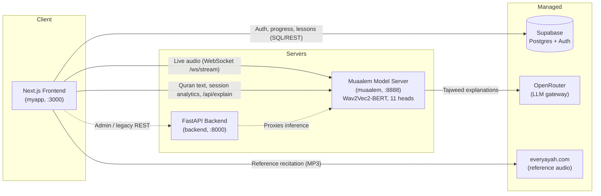

# Tajweed.AI

**AI-powered Qur'an recitation coach — منصة تحليل التلاوة بالذكاء الاصطناعي**

Tajweed.AI listens to a learner reciting the Qur'an, analyses the recitation **on a per-letter, per-attribute level in real time**, highlights exactly where the rules of *tajweed* were broken, and then explains each mistake in clear Arabic and recommends how to fix it. It pairs a streaming speech model with an interactive *mushaf*, lessons, tafsir, and progress tracking.


---

## Table of Contents

- [Overview](#overview)
- [Key Features](#key-features)
- [Architecture](#architecture)
- [Technology Stack](#technology-stack)
- [Repository Structure](#repository-structure)
- [Prerequisites](#prerequisites)
- [Configuration](#configuration)
- [Getting Started](#getting-started)
- [Database and Migrations](#database-and-migrations)
- [How Recitation Analysis Works](#how-recitation-analysis-works)
- [The Tajweed Explanation System](#the-tajweed-explanation-system)
- [API Surface](#api-surface)
- [Exposing the Servers (Mobile and Remote Testing)](#exposing-the-servers-mobile-and-remote-testing)
- [Troubleshooting](#troubleshooting)
- [Roadmap](#roadmap)
- [Acknowledgements](#acknowledgements)
- [License](#license)

---

## Overview

Learning *tajweed* traditionally requires a qualified teacher to listen and correct in person. Tajweed.AI brings that feedback loop to the browser:

1. The learner selects a *surah* and a range of *ayat*, then recites into the microphone.
2. Audio streams over a WebSocket to a speech model that transcribes phonemes and evaluates the articulation attributes (*sifat*) of every letter against the correct reference.
3. The *mushaf* colours each letter live — correct, pending, or erroneous — and labels the kind of error (madd, ghunna, qalqala, makharij, and so on).
4. After the session, a report explains each rule the learner got wrong in natural Arabic, recommends a learning video, and lets them replay the correct recitation of the exact passage.

The platform also includes interactive lessons, an Uthmani *mushaf* with verse-by-verse tafsir, a "listen and repeat" trainer across dozens of reciters, and a personal progress dashboard with per-rule mastery.

---

## Key Features

- **Real-time recitation analysis** — letter-level feedback streamed live as you recite, powered by a multi-head CTC speech model.
- **Per-rule mistake detection** — distinguishes 13 canonical tajweed error categories (madd, ghunna, qalqala, tafkheem/tarqeeq, hams/jahr, shidda, safeer, istitala, vowels, letter attributes, articulation points, omission, insertion).
- **Post-session explanation report** — a hybrid retrieval + LLM system explains each mistake in Arabic, grounded in a curated rule knowledge base, and recommends a matching video lesson.
- **Listen again** — replay the correct reference recitation of a specific mistake's *ayat* or the whole recited passage, in the reciter of your choice.
- **Interactive lessons** — structured tajweed curriculum with theory, audio examples, and practical quizzes.
- **Qur'an with tafsir** — Uthmani script with on-tap verse-by-verse tafsir.
- **Listen and repeat** — reference recitations from dozens of well-known reciters.
- **Progress and mastery** — streaks, XP, and per-rule mastery tracked in Supabase.

---

## Architecture

Three independently deployable services plus managed Postgres (Supabase) and an LLM gateway (OpenRouter).



| Service | Path | Port | Responsibility |
| --- | --- | --- | --- |
| **Frontend** | `myapp/` | 3000 | Next.js app: recitation UI, mushaf, lessons, tafsir, progress. Talks directly to Supabase for auth/data and to the model server for live analysis. |
| **Model server (Muaalem)** | `muaalem/` | 8888 | FastAPI + PyTorch. Runs the speech model, streams analysis over WebSocket, serves Qur'an text, session analytics, and the tajweed explanation endpoint. |
| **Backend** | `backend/` | 8000 | FastAPI. Admin operations, content management, and a parallel copy of the explanation service. (A legacy MongoDB + Clerk path also lives here; the active data/auth plane is Supabase.) |

> Detailed diagrams (system architecture, data flow, and the multi-head CTC design) are in [`diagrams/`](diagrams/) as Mermaid (`.mmd`) sources.

---

## Technology Stack

| Layer | Technologies |
| --- | --- |
| Frontend | Next.js 16, React 19, Zustand, design tokens, Framer Motion, Recharts, Howler.js, lucide-react |
| Auth and data | Supabase (Postgres, Auth, Row Level Security, Storage) |
| Model server | Python 3.10+, FastAPI, Uvicorn, PyTorch, Transformers, `quran-transcript`, diff-match-patch |
| Speech model | Wav2Vec2-BERT multi-head CTC (`obadx/muaalem-model-v3_2`), 16 kHz |
| Backend | Python 3.12, FastAPI, Motor (MongoDB), httpx, Pydantic v2 |
| Explanations | OpenRouter (OpenAI-compatible API) with a curated static knowledge-base fallback |
| Reference audio | everyayah.com |

---

## Repository Structure

```
tajweed.ai/
├── myapp/                  # Next.js frontend (:3000)
│   ├── src/app/            # Routes: live-moshaf, practice, lessons, listen, tafseer, progress, ...
│   ├── src/components/     # UI (mushaf engine, recitation report, ...)
│   ├── src/store/          # Zustand store (auth, session, progress)
│   ├── src/utils/          # apiConfig, audioService, errorTypeMap, supabaseClient
│   └── supabase/migrations/# SQL migrations (run in the Supabase SQL editor)
├── muaalem/                # FastAPI model server (:8888)
│   ├── muaalem_server.py   # WebSocket streaming + REST + /api/explain
│   ├── explain_tajweed.py  # Tajweed knowledge base + OpenRouter client
│   └── src/quran_muaalem/  # Inference, phonetization, annotation, explanation
├── backend/                # FastAPI backend (:8000)
│   ├── run.py              # Uvicorn entrypoint
│   └── app/                # routes, services, models, ws proxy
├── diagrams/               # Mermaid architecture and data-flow diagrams
└── README.md
```

---

## Prerequisites

- **Node.js 18+** and npm (frontend)
- **Python 3.10+** (model server) and **Python 3.12** (backend) — separate virtual environments recommended
- **A Supabase project** (free tier is sufficient)
- **An OpenRouter API key** (free models are supported) — optional; without it, explanations fall back to the static knowledge base
- A GPU is recommended for the model server but not required (CPU inference works, with higher latency)

---

## Configuration

Each service reads its secrets from a local environment file that is **git-ignored**. Never commit real keys.

### Frontend — `myapp/.env.local`

| Variable | Required | Description |
| --- | --- | --- |
| `NEXT_PUBLIC_SUPABASE_URL` | Yes | Supabase project URL |
| `NEXT_PUBLIC_SUPABASE_ANON_KEY` | Yes | Supabase anon/public key |
| `NEXT_PUBLIC_WS_URL` | No | WebSocket base for live analysis. Defaults to the model server. |
| `NEXT_PUBLIC_EXPLAIN_URL` | No | Override for the `/api/explain` host. Defaults to the model server. |
| `NEXT_PUBLIC_API_URL` | No | FastAPI backend base URL (admin/legacy features). |

### Model server — `muaalem/.env`

| Variable | Required | Description |
| --- | --- | --- |
| `OPENROUTER_API_KEY` | No | Enables AI explanations. If empty, the static knowledge base is used. |
| `OPENROUTER_MODEL` | No | Primary free model slug (default `openai/gpt-oss-120b:free`). |
| `OPENROUTER_FALLBACK_MODELS` | No | Comma-separated fallback models tried on 404/429. |
| `OPENROUTER_TIMEOUT` / `OPENROUTER_TOTAL_BUDGET` | No | Per-call and total time budgets (seconds) so a slow free model never hangs the report. |

### Backend — `backend/.env`

Copy `backend/.env.example` and fill in:

| Variable | Required | Description |
| --- | --- | --- |
| `MONGODB_URI` | Yes (for backend) | MongoDB connection string (legacy/admin data). |
| `OPENROUTER_API_KEY`, `OPENROUTER_MODEL`, `OPENROUTER_FALLBACK_MODELS` | No | Same explanation config as the model server. |
| `MODEL_SERVER_URL`, `MODEL_SERVER_WS` | No | Where the backend proxies inference. |
| `CLERK_*`, `EMAIL_*` | No | Legacy auth and email integrations. |

> Free OpenRouter model slugs rotate and rate-limit frequently. If explanations are consistently generic (served from the static fallback), set `OPENROUTER_MODEL` to a currently available `:free` slug from `https://openrouter.ai/api/v1/models`, or supply a paid key.

---

## Getting Started

Run the three services in separate terminals. Start the model server first so the frontend can connect.

### 1. Model server (Muaalem, port 8888)

```bash
cd muaalem
# Using uv (recommended; respects uv.lock):
uv run uvicorn muaalem_server:app --host 0.0.0.0 --port 8888
# or with a manual virtual environment:
python -m venv .venv && source .venv/bin/activate
pip install -e .
python muaalem_server.py
```

The model weights download from Hugging Face on first run; wait for the "model loaded" log. Health check: `GET http://localhost:8888/api/health`.

### 2. Backend (FastAPI, port 8000)

```bash
cd backend
python -m venv .venv && source .venv/bin/activate   # or reuse the repo-level venv
pip install -r requirements.txt
python run.py                                        # or: uvicorn app.main:app --port 8000 --reload
```

### 3. Frontend (Next.js, port 3000)

```bash
cd myapp
npm install
npm run dev
```

Open `http://localhost:3000`. On localhost the frontend automatically targets the local servers (`:8000`, `:8888`); for remote or mobile access, set the `NEXT_PUBLIC_*` variables to public URLs (see [Exposing the Servers](#exposing-the-servers-mobile-and-remote-testing)).

---

## Database and Migrations

Auth, profiles, lessons, sessions, mistakes, and per-rule mastery live in Supabase Postgres. Apply the migrations in [`myapp/supabase/migrations/`](myapp/supabase/migrations/) **in order**, via the Supabase SQL editor:

1. `20260611_progress_system.sql` — progress, sessions, mistakes, mastery, and RLS policies.
2. `20260611_admin_system.sql` — admin roles, profile auto-provisioning, content write policies, lesson-video storage bucket.
3. `20260611_site_settings.sql` — site configuration.
4. `20260613_lesson_rule_mapping.sql` — adds `lessons.tajweed_rule` and seeds one lesson per tajweed rule (used to recommend a video for each detected mistake).

After seeding, attach real lesson video URLs from the admin page.

---

## How Recitation Analysis Works

The model server runs a **Wav2Vec2-BERT multi-head CTC** model. One head transcribes phonemes; ten further heads classify the articulation attributes (*sifat*) of each phoneme:

| Head | Attribute | Example values |
| --- | --- | --- |
| Phonemes (CTC) | Phoneme sequence | — |
| `hams_or_jahr` | Whisper vs. voice | hams, jahr |
| `shidda_or_rakhawa` | Intensity | shadeed, between, rikhw |
| `tafkheem_or_taqeeq` | Emphasis | mofakham, moraqaq |
| `itbaq` | Closure | motbaq, monfateh |
| `safeer` | Whistle | safeer, no_safeer |
| `qalqla` | Vibration | moqalqal, not |
| `tikraar` | Repetition | mokarar, not |
| `tafashie` | Spreading | motafashie, not |
| `istitala` | Elongation | mostateel, not |
| `ghonna` | Nasalisation | maghnoon, not |

The streaming flow:

1. The browser captures microphone audio, resamples it to **16 kHz mono**, and streams raw float32 frames over `wss://.../ws/stream`.
2. The server buffers audio, runs inference, and compares the predicted phonemes and attributes against the reference recitation using diff-match-patch.
3. Mismatches are mapped back to Uthmani character positions and pushed to the client as structured per-character annotations (status, error type, severity, tooltip).
4. On stop, the final mistake matrix is persisted to Supabase and handed to the explanation system.

---

## The Tajweed Explanation System

The set of tajweed rules is small and fixed (13 categories), so the system uses **structured retrieval plus generation** rather than a vector database:

- **Retrieval** is a deterministic lookup over a curated rule knowledge base (`muaalem/explain_tajweed.py`) that supplies grounding facts and a guaranteed static fallback.
- **Generation** uses an OpenRouter free model to turn those facts plus the learner's specific mistakes (which *ayah*, expected vs. pronounced) into a warm, contextual Arabic explanation.

The call is bounded by a hard time budget and a model fallback chain, so a slow or rate-limited free model never blocks the report — it simply falls back to the static text. Video recommendations are resolved on the client by joining each rule against `lessons.tajweed_rule` in Supabase.

---

## API Surface

Selected endpoints on the **model server** (`:8888`):

| Method | Path | Description |
| --- | --- | --- |
| `GET` | `/api/health` | Liveness, device, and model id. |
| `GET` | `/api/surahs` | Surah metadata. |
| `GET` | `/api/uthmani` | Uthmani text for a surah/ayah range. |
| `WS` | `/ws/stream` | Live recitation analysis. |
| `POST` | `/api/explain` | Explain a session's tajweed mistakes (LLM + static fallback). |
| `POST` | `/api/session/{id}/end` | Finalise and store session analytics. |
| `GET` | `/api/session/{id}/analytics` | Retrieve a session report. |

The **backend** (`:8000`) exposes admin, lessons, progress, and a parallel `POST /api/explain`. Interactive API docs are available at each server's `/docs`.

---

## Exposing the Servers (Mobile and Remote Testing)

Microphone capture requires a **secure context (HTTPS)**, so testing on a phone or a deployed frontend means the model server must be reachable over `https`/`wss`. A tunnel such as ngrok works well:

```bash
ngrok http 8888
```

Point the frontend at the tunnel by setting `NEXT_PUBLIC_WS_URL` (and `NEXT_PUBLIC_EXPLAIN_URL`) to the public URL. On `localhost`, the frontend uses the local servers automatically.

---

## Troubleshooting

- **No microphone or "permission denied" on a phone:** the page must be served over HTTPS. Use a tunnel and open the `https` URL.
- **Recitation analysis is wrong only on iPhone/Safari:** iOS Safari ignores a requested `AudioContext` sample rate. The frontend resamples to 16 kHz on the client to compensate; make sure you are running the current build.
- **Explanations are always generic:** the free OpenRouter model is rate-limited or its slug rotated. Swap `OPENROUTER_MODEL` for a live `:free` slug or add a paid key. The report still works via the static knowledge base.
- **Model server slow on first start:** weights download from Hugging Face once; subsequent starts are fast. CPU inference is slower than GPU.
- **`.env` files are not committed:** each contributor creates their own from the documented variables and the provided `.env.example` files.

---

## Roadmap

- Replace the deprecated `ScriptProcessorNode` capture path with an `AudioWorklet`.
- Expand the curated video library mapped to each tajweed rule.
- Offline or on-device inference for low-bandwidth use.
- Additional reciters and *qira'at*.

---

## Acknowledgements

- The Muaalem speech model (`obadx/muaalem-model-v3_2`) and the `quran-transcript` toolkit.
- everyayah.com for reference recitations.
- The Qur'an tafsir corpora used in the reader.

---

## License

This project is a capstone/graduation project. Add a license file (for example, MIT) before distributing. The Qur'anic text, recitations, and tafsir are the property of their respective sources and are used for educational purposes.
